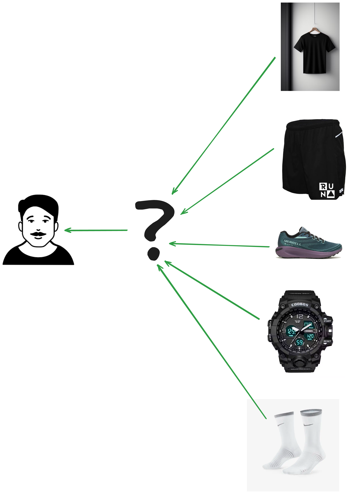
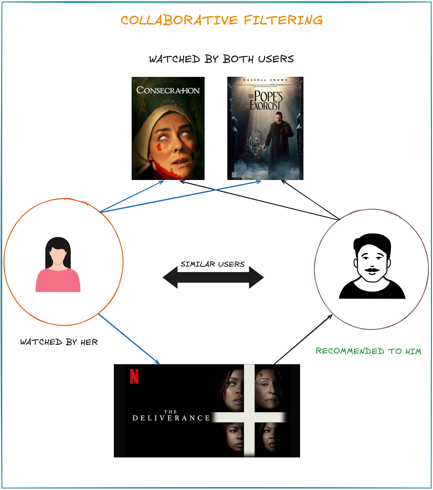
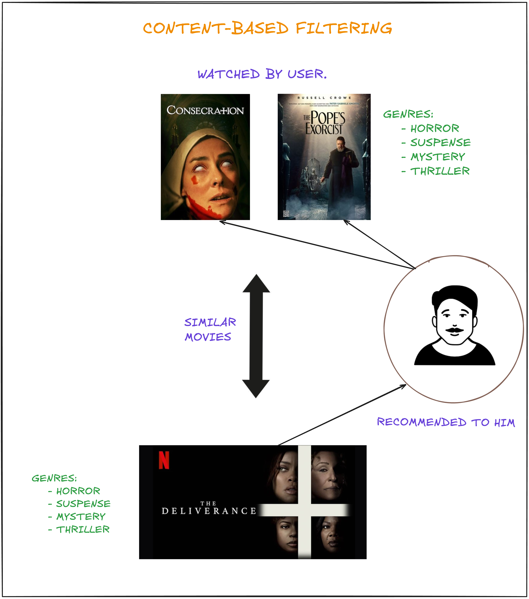

# small-scale-recommendations-systems

A recommendation system is an artificial intelligence or AI algorithm, usually associated with machine learning, 
that uses Big Data to suggest or recommend additional products to consumers. These can be based on various criteria, 
including past purchases, search history, demographic information, and other factors. 
Recommender systems are highly useful as they help users discover products and services they might otherwise have not found on their own.

Recommender systems are trained to understand the preferences, previous decisions, and characteristics of people and products using data gathered about their interactions. 
These include impressions, clicks, likes, and purchases. Because of their capability to predict consumer
interests and desires on a highly personalized level, recommender systems are a favorite with content and product providers. 
They can drive consumers to just about any product or service that interests them, from books to videos to health classes to clothing.

[//]: # (
)

[//]: # (    )

[//]: # (
)

### Types of Recommendation Systems
There are quite a vast number of recommender algorithms and techniques, most fall into these broad categories;
- collaborative filtering,
- content filtering, and
- context filtering

1. `Collaborative Filtering:` CF algorithms recommend items (filtering part) based on preference information from many users (collaborative part).
This approach uses similarity of user preference behaviour, given previous interactions between users and items, recommender algorithms learn to predict future 
interaction. These recommender systems build a model from a user's past behavior, such as items purchased previously or ratings given to those items and similar
decisions by other users. The idea is that if some people have made similar decisions and purchases in the past, like a movie choice, then there is a high 
probability they will agree on additional future selections. For example, if a collaborative filtering recommender knows you and another user share similar tastes in movies,
it might recommend a movie to you that it knows this other user already likes.

    

2. `Content Filtering:` This, by contrast, uses the attributes or features of an item (content part) to recommend other items similar
to the user's preferences. This approach is based on similarity of item and user features, given information about a user and items they
have interacted with (e.g. a user’s age, the category of a restaurant’s cuisine, the average review for a movie), model the likelihood of 
a new interaction. For example, if a content filtering recommender sees you liked the movies `You've Got Mail` and `Sleepless in Seatle`,
it might recommend another movie to you with the same genres and/or cast.

   

    

3. `Context Filtering:` This includes users' contextual information in the recommendation process. `Nexflix` makes better recommendations
by framing a recommendation as a contextual sequence prediction. This approach uses a sequence of contextual user actions, plus the 
current context, to predict the probability of the next action. Given one sequence for each user-the country, device, date, and time when
they watched a movies-`Nexflix` trained a model to predict what to watch next.

### Use Cases and Applications
1. E-Commerce and Retail: Personalized Merchandising
2. Media and Entertainment: Personalized Content
3. Personalized Banking

### How Recommenders Work

